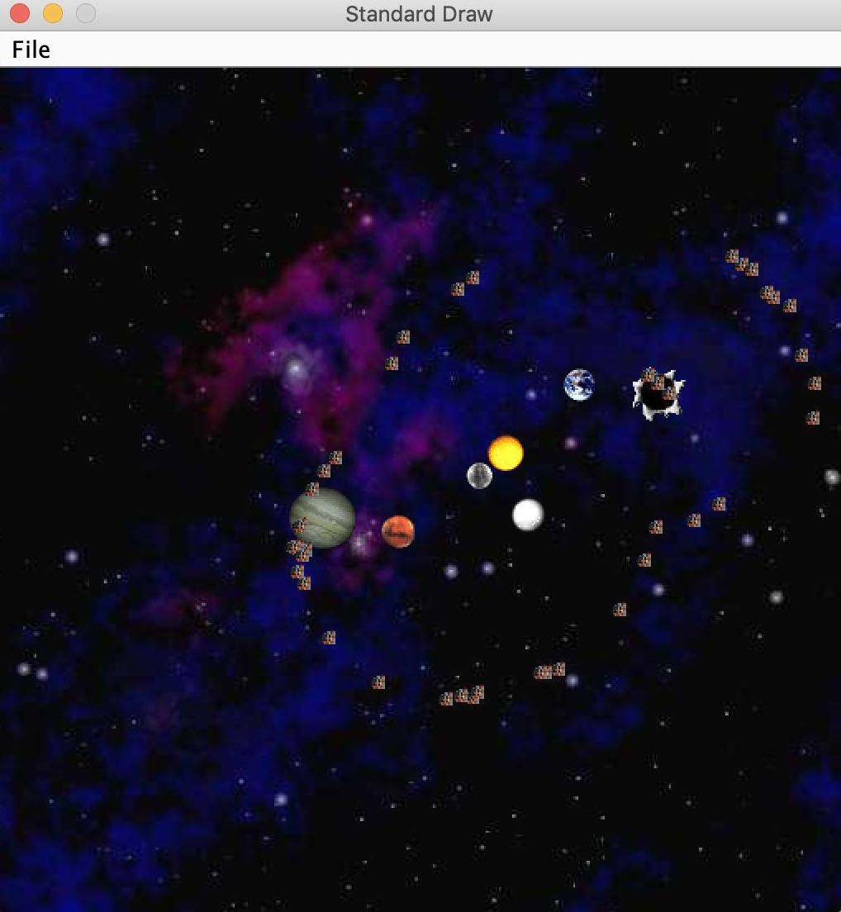

# 2. Lists

### 4.18

#### Array and List:

* Array: size fixed
* List: size flexible

The Golden Rule of Equals \(GRoE\): When you write `y = x`, you are telling the Java interpreter to copy the bits from x into y.

In Java, there are 8 primitive types: byte, short, int, long, float, double, boolean, char. Everything else, including arrays, is not a primitive type but rather a `reference type`.

**Reference Variable Declaration:**

When declaring a reference variable \(Dog, Planet, array, etc.\), Java allocates a box of 64 bits, no matter what type of object. The 64 bit box contains the address of the variable instead of the real data.

#### Finished Proj 0 \(NBody Simulation\):

#### Public vs Private:

different access control to members \(i.e. method or variable\)

**`public` ,** you're effectively committing to supporting that member's behavior exactly as it is now, forever.

**`private`,** only be accessed by code inside the same **`.java`** file, so you can hide details of certain pieces to other users.

#### Nested Classes:

Declaring a nested class as `static` means that methods inside the static class can not access any of the members of the enclosing class.

#### Caching:

Saving intermediate results so we don't need repeated retrieval or calculation, this saves a lot of time.

#### Invariants:

A typical example is dummy node in lists. Adding a dummy node would often save you the extra code for special cases, making the code more clean and simple. 

